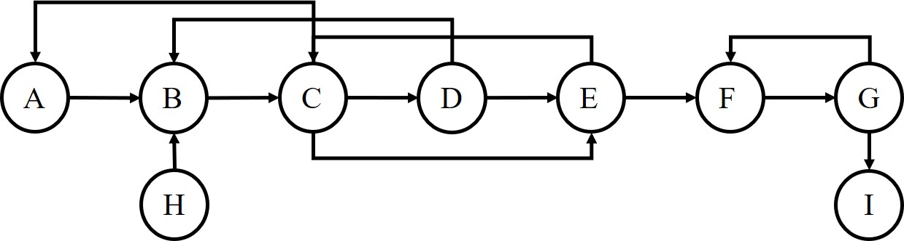
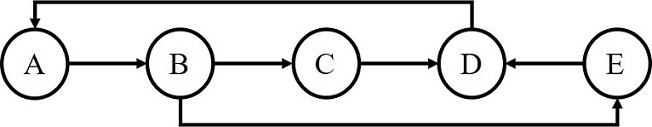
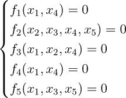
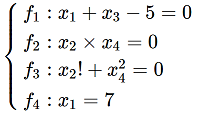
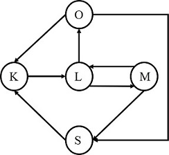
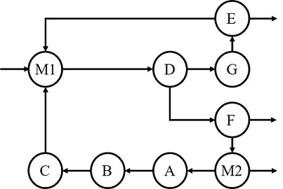

# MiniASPEN

## Documentation

**General Description:**

This project provides solutions to several crucial problems in PSE

Project mainly includes four parts:
1. common utils for project
2. system decomposition utils
3. equation decomposition utils
4. system tearing utils

## Dependencies
**Language:**  python 3.x

package             | version       
------------------- | --------------
*numpy*|1.18.2
*pandas*|1.1.5
*scipy*|1.5.3


**Interpreter:**  python 3.x

## Project Architecture
```buildoutcfg
│  main.py      // main function
│  README.md    // help
│
├─.idea
│  │  .gitignore
│  │  encodings.xml
│  │  MiniASPEN.iml
│  │  misc.xml
│  │  modules.xml
│  │  vcs.xml
│  │  workspace-Surface-Zhichen.xml
│  │  workspace.xml
│  │
│  └─inspectionProfiles
│          profiles_settings.xml
│
├─common            // common utils
│  │  Graph.py      // graph class
│  │  Sys2Graph.py  // convert system to graph representation
│  │  Sys2Matrix.py // convert system to matrix representation
│  │  __init__.py   // initilization function for common utils
│  │
│  └─__pycache__
│          Graph.cpython-37.pyc
│          Sys2Graph.cpython-37.pyc
│          Sys2Matrix.cpython-37.pyc
│          __init__.cpython-37.pyc
│
├─decompose                 // system decomposition utils
│  │  Decompose.py          // decomposition class
│  │  EqSolver.py           // equation solver class
│  │  OutputSelection.py    // select optimal output variables for equations
│  │  __init__.py           // initialization function for decomposition utils
│  │
│  └─__pycache__
│          Decompose.cpython-37.pyc
│          EqSolver.cpython-37.pyc
│          OutputSelection.cpython-37.pyc
│          __init__.cpython-37.pyc
│
├─examples  // example demos
│      Decompose_ex1.txt
│      Decompose_ex2.txt
│      Eq_ex1.txt
│      Eq_ex2.txt
│      Tear_ex1.txt
│      Tear_ex2.txt
│
├─images    //images
│      Decompose_ex1.jpg
│      Decompose_ex2.jpg
│      Eq_ex1.png
│      Eq_ex2.png
│      Tear_ex1.jpg
│      Tear_ex2.jpg
│
└─tear  // system tear utils
   │  IntProg.py    // integer programming class
   │  TearSolver.py // system tearing solver class
   │  __init__.py   // initialization function for system tearing utils
   │
   └─__pycache__
           IntProg.cpython-37.pyc
           TearSolver.cpython-37.pyc
           __init__.cpython-37.pyc
```

## Usage
### System Decomposition
- To run a system decomposition:
Construct your problem set in a txt file according to the following format
```
{'node1':['nodes_connected_to_node1'], 'node2':['nodes_connected_to_node2'],...}
```
Store your problem set in folder '/examples', and run the following command in your terminal
```
> python main.py --task decompose --example name_of_your_problem_set.txt
```

### Equation Decomposition
- To run a equation decomposition:
Construct your problem set in a txt file according to the following format
```
{'equation1':['variables_in_equation1'], 'equation2':['variables_in_equation2'],...}
```
Store your problem set in folder '/examples', and run the following command in your terminal
```
> python main.py --task equation --example name_of_your_problem_set.txt
```

### System Tearing
- To run a system tearing:
Construct your problem set in a txt file according to the following format
```
{'node1':['nodes_connected_to_node1'], 'node2':['nodes_connected_to_node2'],...}
```
Store your problem set in folder '/examples', and run the following command in your terminal
```
> python main.py --task tear --example name_of_your_problem_set.txt
```

## Examples
### System Decomposition
**Decompose_ex1**



Run the following command in your terminal
```
> python main.py --task decompose --example Decompose_ex1.txt
```

**Decompose_ex2**



Run the following command in your terminal
```
> python main.py --task decompose --example Decompose_ex2.txt
```

### Equation Decomposition
**Eq_ex1**



Run the following command in your terminal
```
> python main.py --task equation --example Eq_ex1.txt
```

**Eq_ex2**



Run the following command in your terminal
```
> python main.py --task equation --example Eq_ex2.txt
```

### System Tear
**Tear_ex1**



Run the following command in your terminal
```
> python main.py --task tear --example Tear_ex1.txt
```

**Tear_ex2**



Run the following command in your terminal
```
> python main.py --task tear --example Tear_ex2.txt
```
