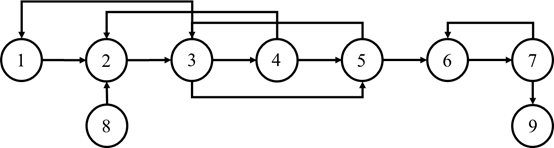
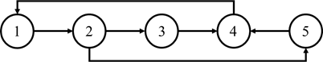
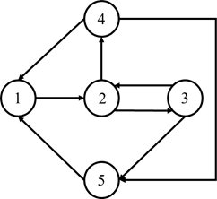
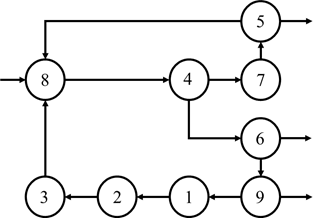

# MiniASPEN

## General Description

This project provides solutions to several crucial problems in PSE

Project mainly includes five parts:
1. common utils
2. system decomposition solver
3. equation decomposition solver
4. system tearing solver
5. heat exchange network synthesis solver

## Dependencies
**Language:**  python 3.x

package | version       
:-----: | :-----:
*numpy*|1.18.2
*pandas*|1.1.5
*scipy*|1.5.3


**Interpreter:**  python 3.x

## Usage
### System Decomposition

- Construct your problem set in a txt file according to the following format
```
{'node1':['nodes_connected_to_node1'], 'node2':['nodes_connected_to_node2'],...}
```
- Store your problem set in folder '/examples', and run the following command in your terminal
```
> python main.py --task decompose --problem_set name_of_your_problem_set.txt
```

### Equation Decomposition

- Construct your problem set in a txt file according to the following format
```
equation1_name: equations
equation2_name: equations
...
```
- Make sure variables are quoted with quotation "", e.g.
```
f1: "x1" + "x2" * "x3" + 5 = 0
```
- Store your problem set in folder '/examples', and run the following command in your terminal
```
> python main.py --task equation --problem_set name_of_your_problem_set.txt
```

### System Tearing

- Construct your problem set in a txt file according to the following format
```
{'node1':['nodes_connected_to_node1'], 'node2':['nodes_connected_to_node2'],...}
```
- Store your problem set in folder '/examples', and run the following command in your terminal
```
> python main.py --task tear --problem_set name_of_your_problem_set.txt --cost type_of_cost_function
```
- To select cost function for tearing, choose either 1 for minimize #loops, or 2 for minimize #edges

### Heat Exchange Network Synthesis
- Construct your problem set in a txt file according to the following format
```
{'streams':{'name_of_stream1':['ts':Tin, 'tt':Tout, 'c':Fcp], 'name_of_stream2':['ts':Tin, 'tt':Tout, 'c':Fcp],...}, 'delta_t': △T_min}
```
- Store your problem set in folder '/examples', and run the following command in your terminal
```
> python main.py --task hen --problem_set name_of_your_problem_set.txt
```

## Examples
### System Decomposition
**graph_1**



- Run the following command in your terminal
```
> python main.py --task decompose --problem_set graph_1.txt
```

**graph_2**



- Run the following command in your terminal
```
> python main.py --task decompose --problem_set graph_2.txt
```

### Equation Decomposition
**eq_1**
```markdown
f1: 2 * "x1" + 5 * "x4" ^ 2 = 0
f2: 3 * "x2" * "x3" + "x4" - "x5" = 0
f3: "x1" + "x2" ^ "x4" = 0
f4: "x1" + "x4" = 0
f5: "x1" / "x3" + "x5" = 0
```
- Run the following command in your terminal
```
> python main.py --task equation --problem_set eq_1.txt
```

**eq_2**

```markdown
f1: "x1" + "x3" * "x5" - 5 = 0
f2: "x2" + 1.5 * "x4" / "x7" = 0
f3: "x3"! + "x5"^2 + "x1" +9 = 0
f4: "x4"+"x15" + 29 = 0
f5: "x5" * "x17" - "x3" +17.4 = 0
f6: "x6" + "x9" -"x18"^3 = 0
f7: "x7" / "x1" + 1.45 * "x11" = 0
f8: "x8" + "x11" / "x2" +3.14 = 0 
f9: "x9" / "x3" * "x2"+ "x6" +5.12 = 0
f10: "x10" + "x4" - "x5" = 0
f11: "x11" - "x14" * "x7" = 0
f12: "x12" - "x3" + 1.97 = 0
f13: "x13" * "x1" - 3 = 0
f14: "x14" - 3.97 * "x11" = 0
f15: "x15" * "x9 " - "x4" = 0
f16: "x16" * "x3" + "x1" +1.97 = 0  
f17: "x17" * "x1" - 1.45 * "x5" = 0
f18: "x18" / "x19" +3.19 = 0
f19: "x19" + "x20" * "x18" = 0
f20: "x20" - 1.48 * "x18" + 3 = 0
```
- Run the following command in your terminal
```
> python main.py --task equation --problem_set eq_2.txt
```

### System Tear
**graph_3**



- Run the following command in your terminal
```
> python main.py --task tear --problem_set graph_3.txt --cost 1
```

**graph_4**



- Run the following command in your terminal
```
> python main.py --task tear --problem_set graph_4.txt --cost 2
```

### Heat Exchange Network Synthesis
**streams_1.txt**

stream|ts|tt|c
:---:|:---:|:---:|:---:
H<sub>1</sub>|150|60|2.0
H<sub>2</sub>|90|60|8.0
C<sub>1</sub>|20|125|2.5
C<sub>2</sub>|25|100|3.0
**△T_min**: 20


- Run the following command in your terminal
```
> python main.py --task hen --problem_set streams_1.txt
```

**streams_2.txt**

stream|ts|tt|c
:---:|:---:|:---:|:---:
H<sub>1</sub>|215|110|3.0
H<sub>2</sub>|200|80|1.5
C<sub>1</sub>|130|190|4.0
C<sub>2</sub>|70|185|2.0
**△T_min**: 10

- Run the following command in your terminal
```
> python main.py --task hen --problem_set streams_2.txt
```

## Project Architecture

```buildoutcfg
│  MiniASPEN.py  // main function
│  README.md     // help
│
├─common    // common utils
│      EqParse.py       // reformat input equations
│      Graph.py         // data structures for graph
│      Sys2Graph.py     // convert system to graph representation
│      Sys2Matrix.py    // convert system to matrix representation
│      __init__.py      // initilization script for common utils
│
├─decompose     // system decomposition solver
│      Decomposer.py        // decomposition solver
│      EqSolver.py          // equation solver
│      OutputSelection.py   // select optimal output variables for equations
│      __init__.py          // initialization script for decomposition utils
│
├─examples  // problem sets
│      eq_1.txt
│      eq_2.txt
│      eq_3.txt
│      graph_1.txt
│      graph_10.txt
│      graph_11.txt
│      graph_2.txt
│      graph_3.txt
│      graph_4.txt
│      graph_5.txt
│      graph_6.txt
│      graph_7.txt
│      graph_8.txt
│      graph_9.txt
│      streams_1.txt
│      streams_2.txt
│      streams_4.txt
│
├─exchanger // heat exchange network systhesis solver
│      HENSolver.py // hext exchange network solver
│      StreamData.py    // data structures for stream
│      StreamProcessor.py   // reformat input heat exchange network
│      __init__.py  // initialization script for heat exchange network utils
│
├─images    //images
│      graph_1.png
│      graph_2.png
│      graph_3.png
│      graph_4.png
│
└─tear  // system tear solver
        IntProg.py      // integer programming solver
        TearSolver.py   // system tearing solver
        __init__.py     // initialization script for system tearing utils
```